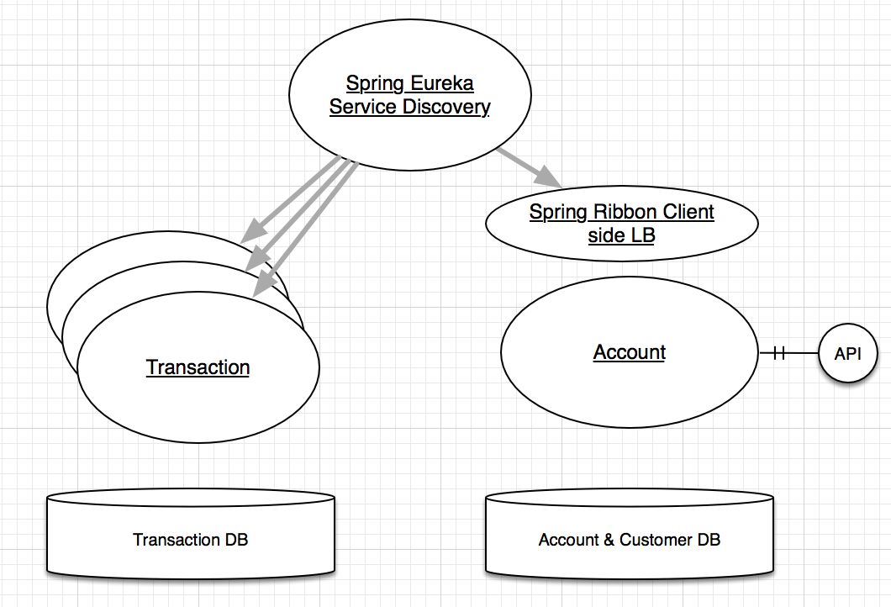

## Transaction and Account Microservice ##

This Microservice exposes two APIs 
1. The API will expose an endpoint which accepts the user information (customerID, initialCredit).
Once the endpoint is called, a new account will be opened connected to the user whose ID is customerID. Also, if initialCredit is not 0, a transaction will be sent to the new account.

2. Another Endpoint will output the user information showing Name, Surname, balance, and transactions of the accounts. 

### Architecture Diagram ###

### Installation ###

#### Pre resiquites ####

##### To run the Application #### 
1. JRE 1.8
2. Linux Bash Shell
3. screen (to open multiple session in background)

##### To build the code #####
1. maven 

Three Jar file already build in my machine is being provided. You can run it either by  
 1. > **java -jar -Dserver.port=\< port number \> \<jar file location\>**
 2. > Run install.sh
    - It will open four screen session which will be running the following
      - microserviceDns service 8761
      - account Service in port 8000
      - transaction service in port 8081
      - transaction service in port 8082 

### Testing ###

